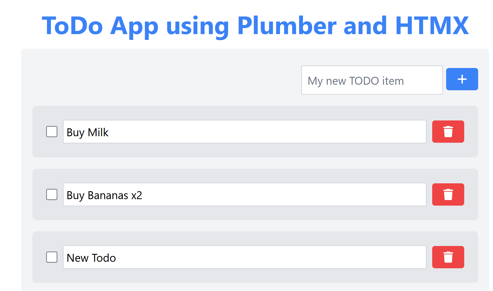

# Plumber + HTMX + TailwindCSS TODO App

This is a simple TODO app built with [Plumber](https://www.rplumber.io), [HTMX](https://htmx.org) and [TailwindCSS](https://tailwindcss.com/).

Why? Because I wanted to see how easy it would be to build a simple app with these tools.

## Running the app

To run the app and start the server, simply run
```bash
$ Rscript run_app.R
```

and you should be able to see the app running at `http://localhost:8000`, which might look something like this:



The backend should show something like this (note `Rebuilding ... Done in XXXms` refers to tailwindcss rebuilding the css file)
```
Rscript run_app.R

Rebuilding...

Done in 396ms.
Running plumber API at http://127.0.0.1:8080
Running swagger Docs at http://127.0.0.1:8080/__docs__/
GET / 
GET /tailwind.css 
GET /list 
GET /favicon.ico 
POST /edit/1 
  - Updated file: ID <1> -> title 'Buy Milk and Bread'    
POST /toggle/2 
  - Updated file: ID <2> is checked: TRUE
POST /add 
  - Updated file: added ID <6> -> title 'Buy Butter'  
```

The app stores its data in a plain `data.RDS` file, which is read, and written to every time you change something... so it's not a very smart solution as multiple concurrent user would break it most likely..., but it's simple and can be improved if needs be.

## Structure

The API backend is written in R, using the [Plumber](https://www.rplumber.io) package.
The frontend is written in plain HTML, with [HTMX](https://htmx.org) and [TailwindCSS](https://tailwindcss.com/).

The API routes can be found in `plumber.R`, which read the templated HTML files in `templates/`.
